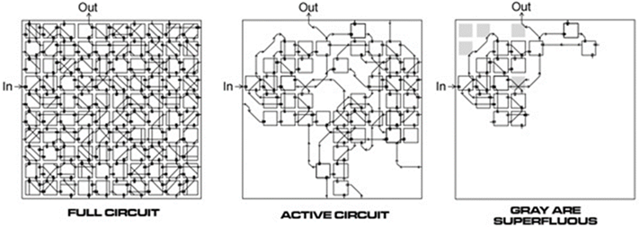
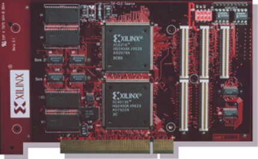
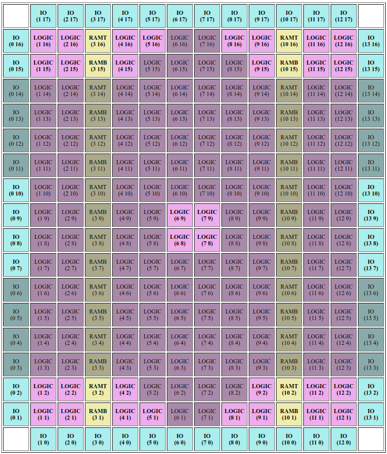

# History of Evolvable Hardware

The broader field of evolvable hardware is taxonomized into several subdomains and practices: digital or analog, intrinsic, extrinsic, or mixtrinsic, adaptive hardware (AH) or evolvable hardware design (EHD) to name a few. For a complete overview of the field's structure, see the work of Haddow and Tyrell. The focus of the work presented here is formally categorized as intrinsic analog evolvable hardware design, meaning populations of circuits are evolved intrinsic to a hardware substrate and do not actively adapt to changes in their environment.

At its origin, EHW aimed to revolutionize the way electronics were designed, both digital and analog. Unlike its digital counterpart, though, analog circuit design must inherently contend with the unique semiconductor physics at each timescale relevant to its operational states, an obstacle that digital circuit design overcomes by abstracting away continuous state values in the time domain through the employment of clock signals and in the voltage domain by logic levels. Analog EHW offered a way to simplify the creation of these complex circuits by delegating the search and design process to artificial evolution.

Further, one of the hallmark characteristics of intrinsic analog EHW is the ability for evolution to employ physical properties of the target hardware that would otherwise be abstracted away during digital operation or simulation due to the complex nature of real-world high-speed semiconductor physics. Simulations generally perform this abstraction to account for the slight error introduced during fabrication (i.e. transistor doping levels, variation in copper tracing thickness, etc.). The effects that such manufacturing imperfections have on the operation of a given circuit are non-linear and can interact in unpredictable ways. Such attempts to simulate analog circuit operation prior to embedding in physical hardware must contend with the reality gap --- the abstract distance between a simulated system's behavior and a real system's behavior. This is where the intrinsic approach to hardware evolution shines. Famously, Adrian Thompson's tone discriminator exploited just such physical properties of the FPGA, using only 100 logic gates of the available 24,000, to accomplish a task that was thought to be impossible under the resource constraints he placed on the experiment. 

/// caption
Analysis of Adrian Thompson's Evolved Tone Descriminator Circuit
///

## Inception and History
In 1991, Hugo de Garis postulated that evolutionary algorithms such as genetic programming "will probably lead to electronic circuits being `grown' in special hardware". Contextually, he was referring to a research domain known as embryological electronics; however, only two years later, in conjunction with Tetsuya Higuchi, they conceptualized the field of evolvable hardware (EHW): the application of evolutionary algorithms to hardware systems during design, operation, or both. It is a technique that has demonstrated the capability of producing unique and often optimal solutions to many types of scientific and industry problems. And the tool of choice was the field programmable gate array (FPGA).

FPGAs are one of the primary research tools used in EHW research because their physically reprogrammable architecture can emulate candidate circuits. When combined with an evolutionary algorithm (EA) running on a host CPU, circuits can be systematically selected from a population, loaded on the FPGA, evaluated for their performance according to a fitness function, selected for progenation, then mutated and recombined for the subsequent population, gradually improving the performance of a population of circuits.

{: align=left : width=250}

As the field was forming, Adrian Thompson at the University of Sussex evolved a series of bitstream-evolution circuits that would canonize the evolutionary approach to circuit design, specifically for analog EHW. The first among these circuits was a completely analog millisecond oscillator. Ultimately, this was meant to be a tool for future robotics experiments, providing a temporal bridge for signals that operate at biological timescales. Later experiments demonstrated the impressive search power provided by artificial evolution, most notably: Thompson's evolved tone-discriminator circuit --- a fully analog FPGA circuit that could distringuish between a 1khz tone and a 10khz tone using only 42 configurable logic blocks.

## Xilinx Discontinues XC6200

Unfortunately for the budding research field, shortly after the cornerstone achievements of the late 1990s, the Xilinx Corporation discontinued the electronic tool of choice for evolvable hardware: the Xilinx XC6200 series FPGA. To comprehend the severity of this loss, it is imperative to understand what a bitstream is and how it was used in evolvable hardware experiments. The bitstream of an FPGA is a binary configuration file used to define and program a circuit architecture for emulation. It is the lowest level of programmable instruction akin to assembly language, though instead of executing a series of instructions, it configures a circuit using the reprogrammable interconnects and logic resources on an FPGA. In essence, the bitstream is the genome of physically realizable circuits on an FPGA. The XC6200 series was unique in that its bitstream format was made available, ergo 1:1 relationships between configuration file entries and in silico resources were unambiguously documented for the end user. However, for cost and security reasons, FPGA manufacturers moved away from open bitstream documentation and began employing strongly encrypted bitstreams.

{: align=right : width=300}

While prudent on behalf of industry concerns, the discontinuation of openly documented bitstreams temporarily halted research on intrinsic analog evolvable hardware. Without complete knowledge of a bitstream's format, EHW researchers were unable to perform analog experiments intrinsic to the FPGA. And although other forms of dynamically reconfigurable hardware have been available to practitioners of EHW, such as field programmable analog arrays (FPAAs) and transistor arrays (FPTAs), none of these technologies are as thoroughly developed, widely accessible, or employed as FPGAs.

## [Project Icestorm](http://www.clifford.at/icestorm/)

{: align=left : width=300}

As mentioned in the previous section, the termination of the Xilinx XC6200 series FPGA halted bitstream-level intrinsic analog EHW experiments. However, recent reverse-engineering efforts by [Project Icestorm](http://www.clifford.at/icestorm/) have paved a way using a different FPGA technology stack altogether. The Lattice iCE40 --- an ultra-low power, economy-grade FPGA package whose fully documented bitstream was exposed in work demonstrated at the Chaos Communication Congress in Hamburg, Germany, in 2015 --- now enables further research into FPGA-intrinsic analog EHW. Although the purpose of reverse-engineering the iCE40 bitstream was not motivated by EHW research, a fully documented bitstream is now available for just that. 

## Bitstream Evolution with the iCEStick HX1K (2021)

TBD

## Bitstream Evolution with the Pico2iCE boards (2025+)

TBD

