---
hide:
	- toc
---

# Hardware Setup
*Bitstream Evolution v1 — iCEstick*

Before ordering any parts, please note that the current Bitstream Evolution toolchain supports Linux and macOS host machines. The steps below mirror the original hardware tutorial and walk through a low-cost way to assemble the evaluation platform.

## Bill of Materials

| Item | Approx. Cost | Where to Purchase |
| --- | --- | --- |
| Microcontroller (Arduino Nano compatible) | ~$10 | [Arduino Nano Kit](https://www.amazon.com/REXQualis-Board-ATmega328P-Compatible-Arduino/dp/B07WK4VG58) |
| Lattice iCEstick HX1K FPGA | ~$150 | [Mouser iCE40HX1K-STICK-EVN](https://www.mouser.com/ProductDetail/Lattice/ICE40HX1K-STICK-EVN?qs=hJ2CX3hEdVEyBLaHAEXelA%3D%3D) |
| 2x40 male headers (soldered to FPGA) | ~$10 | [Hammer Header Kit](https://www.amazon.com/MCIGICM-Header-2-45mm-Arduino-Connector/dp/B07PKKY8BX) |
| Male-to-male jumper wires | ~$5 | [Elegoo Jumpers](https://www.amazon.com/Elegoo-EL-CP-004-Multicolored-Breadboard-arduino/dp/B01EV70C78/) |
| Male-to-female jumper wires | ~$5 | [Elegoo Jumpers](https://www.amazon.com/Elegoo-EL-CP-004-Multicolored-Breadboard-arduino/dp/B01EV70C78/) |
| Full-size breadboard | ~$10 | [MCIGICM Breadboard 2-pack](https://www.amazon.com/Pcs-MCIGICM-Points-Solderless-Breadboard/dp/B07PCJP9DY) |

_Total hardware cost: roughly $190 USD._

## Assembly Steps

### 1. Inspect the Kit

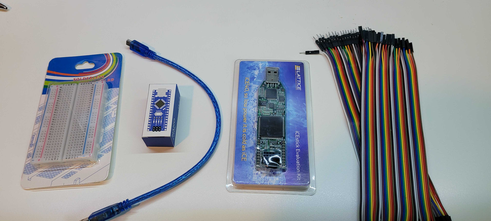

Verify that the MCU, FPGA, jumper wires, and breadboard all arrived intact before you begin.

### 2. Add Headers to the FPGA

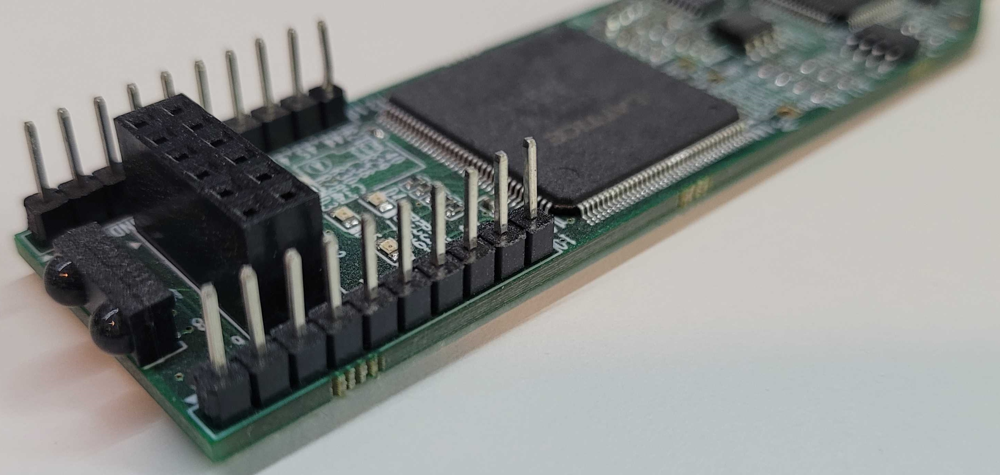

Solder (or press-fit hammer) headers onto both sides of the FPGA so that every I/O pin is accessible from the breadboard or jumper wires.

### 3. Seat the MCU in the Breadboard

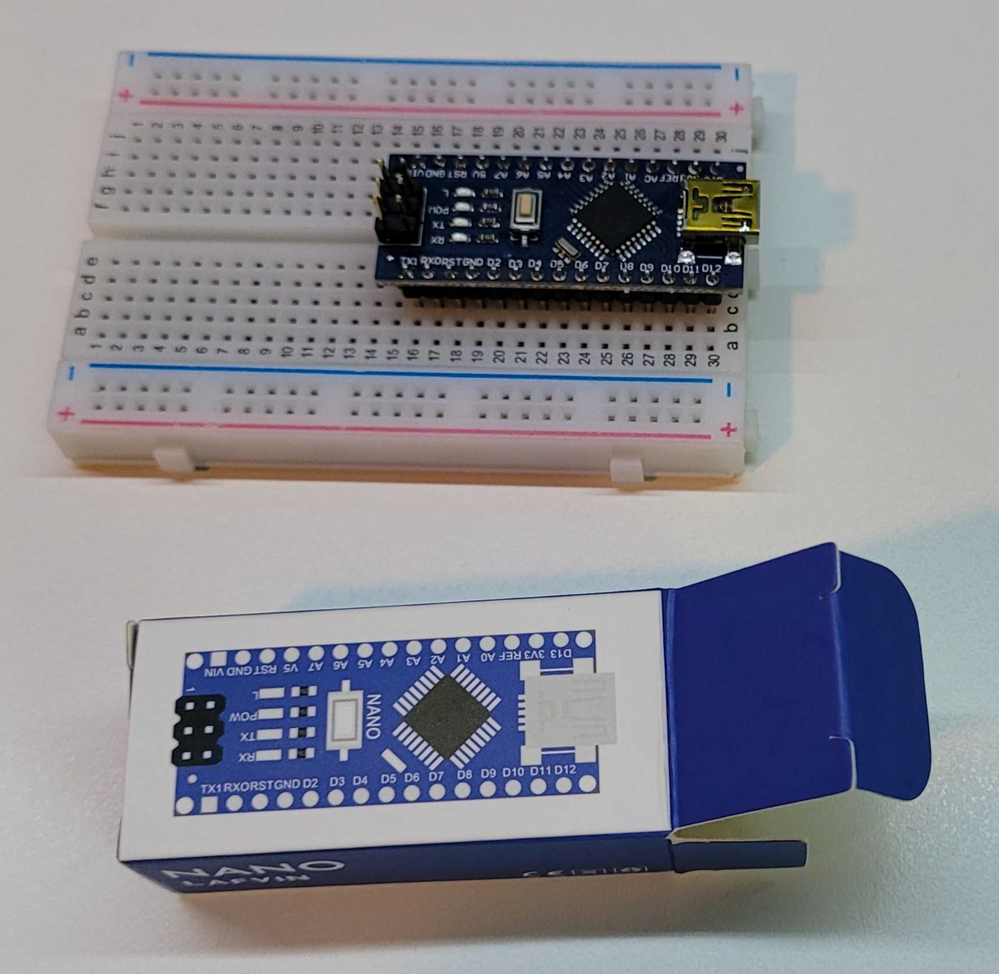
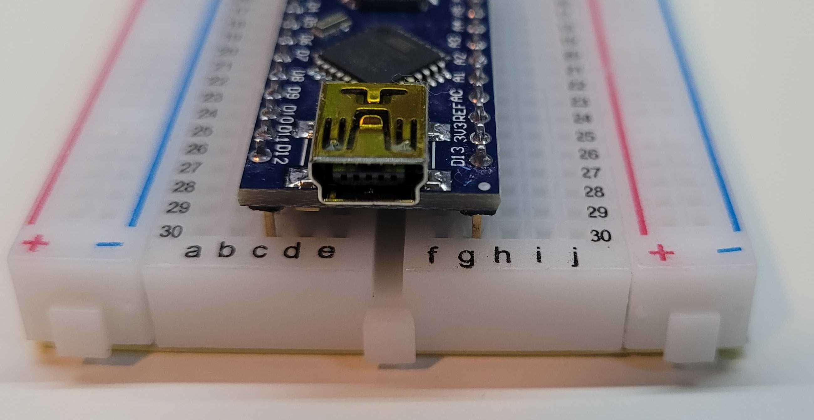

Align the Arduino Nano so that each row of pins straddles the breadboard’s center channel and press down until the pins are fully seated.

### 4. Connect the MCU USB Cable

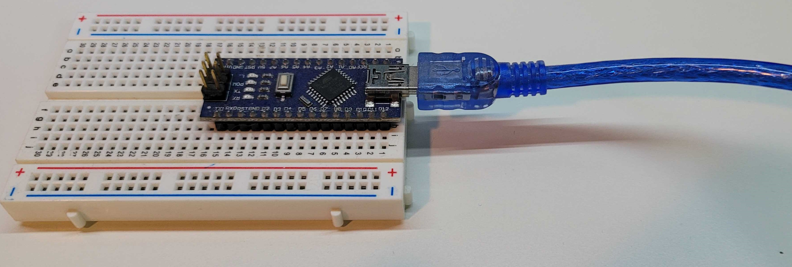

Attach the mini-USB cable to the Arduino Nano. The connector only fits one way—avoid forcing it.

### 5. Plug the MCU into Your Computer or USB Hub

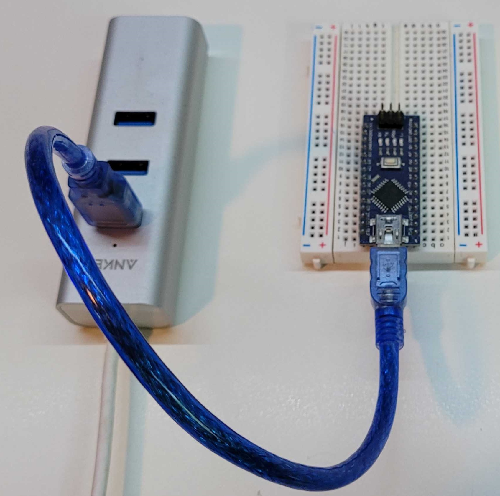

Either connect through a powered USB hub (recommended when sharing ports with the FPGA) or plug the cable directly into your workstation.

### 6. Connect the FPGA via USB

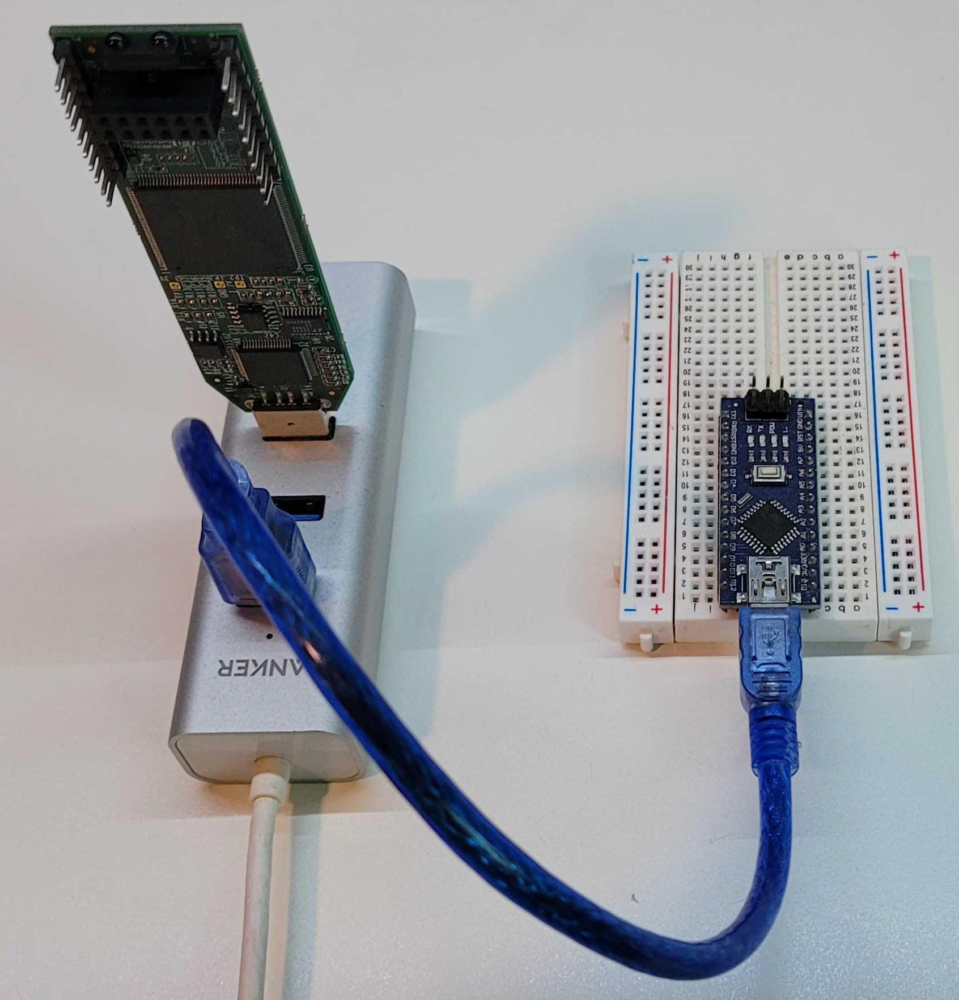

Use the supplied micro-USB cable to power and program the iCEstick. Again, a powered hub is helpful but optional.

### 7. Bridge Arduino Pins A0 and D2

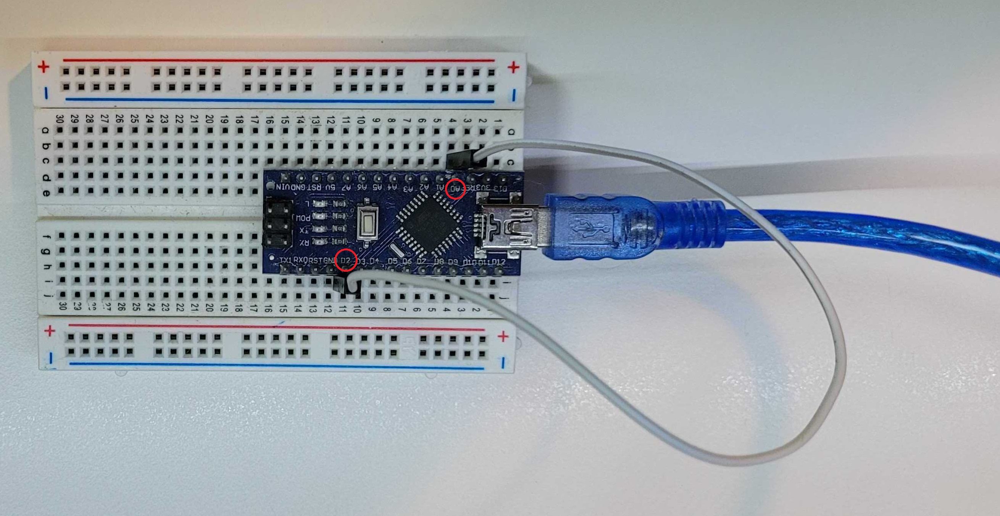

Place a male-to-male jumper between analog pin A0 and digital pin D2. This loopback lets the MCU monitor its own DAC/ADC signal path during experiments.

### 8. Wire the MCU to the FPGA

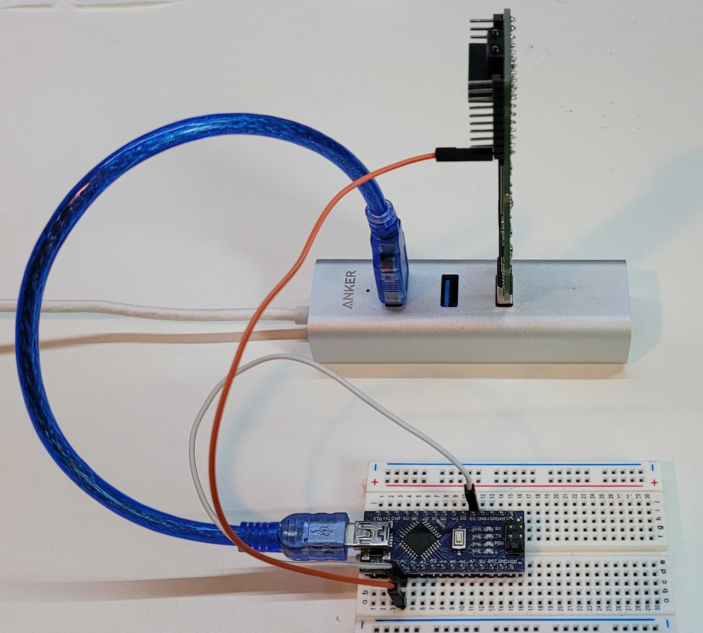

| | |
| --- | --- |
| 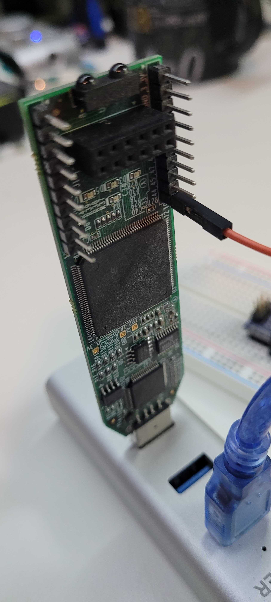 | 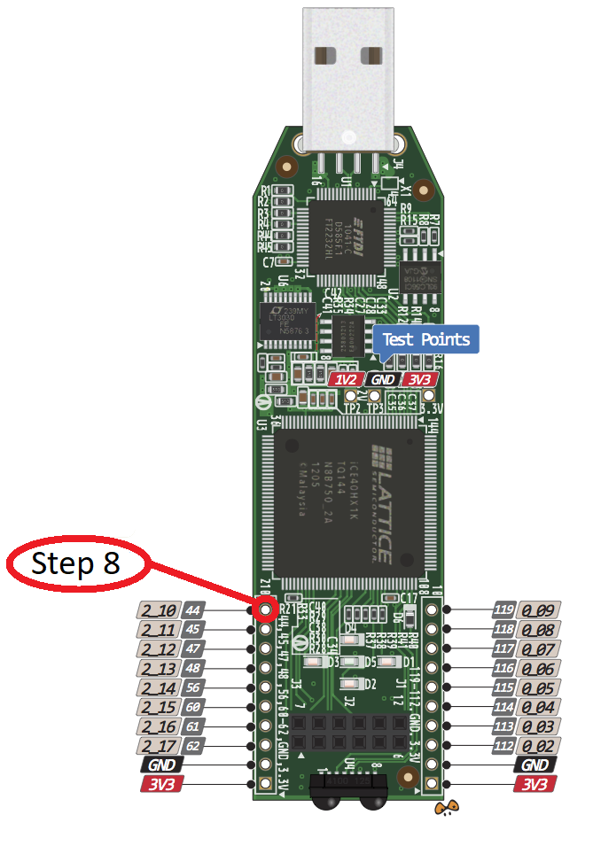 |

Use a male-to-female jumper to connect Arduino pin A0 to FPGA pin 10 (labeled on the iCEstick silkscreen and in the pinout above). Double-check continuity before powering the boards.

