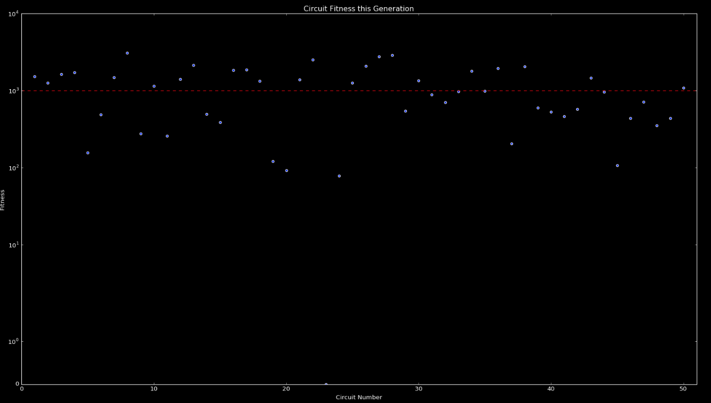
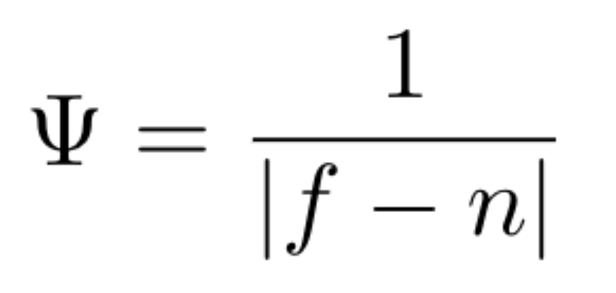
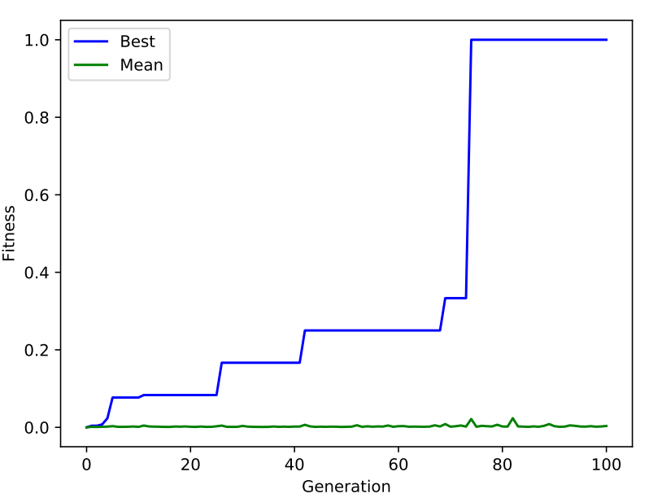
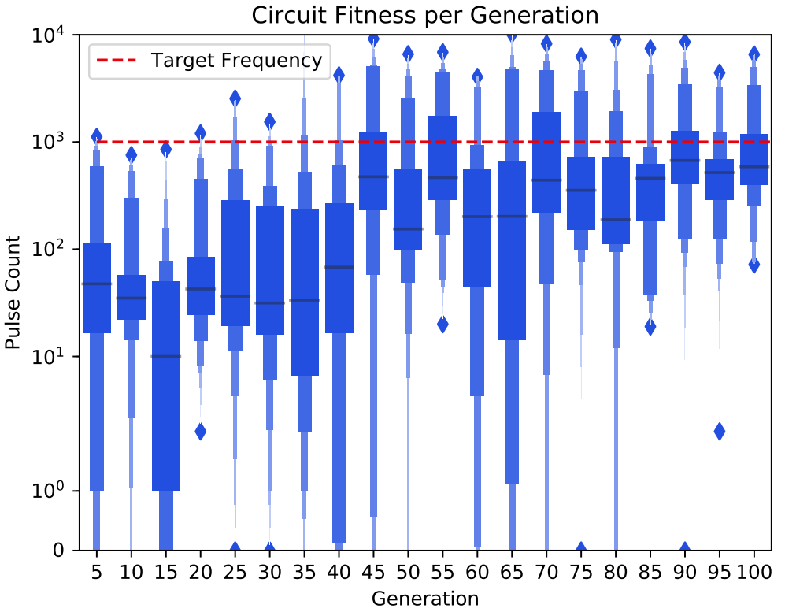

# Pulse Oscillation

This experiment evolves FPGA-resident circuits that emit a stable pulse at a target frequency. It builds on the same intrinsic workflow as variance maximization but pushes evolution to coordinate timing behavior instead of raw amplitude.

## Experiment Snapshot

| Runtime | Population | Generations | Mutation Rate | Crossover Rate |
| --- | --- | --- | --- | --- |
| 10–12 hours | 50 | 100 | 0.005 | 0.5 |

## Fitness Function

Fitness is computed as the inverse of the absolute difference between the target frequency $f$ and the measured frequency $n$. When $f = n$ the function short-circuits the divide-by-zero case and awards a fitness of 1000, giving evolution a crisp gradient toward the desired pulse rate.

## Results

Search trajectories are sensitive to physical noise, so no two runs look identical. In the featured run, fitness climbed steadily for roughly 70 generations before spiking to the maximum attainable score, where it remained for the rest of the experiment. The log-scale view reveals the broader population steadily chasing the leading individual despite appearing flat in linear space.
