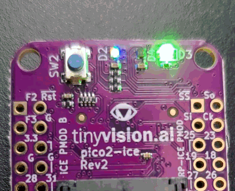
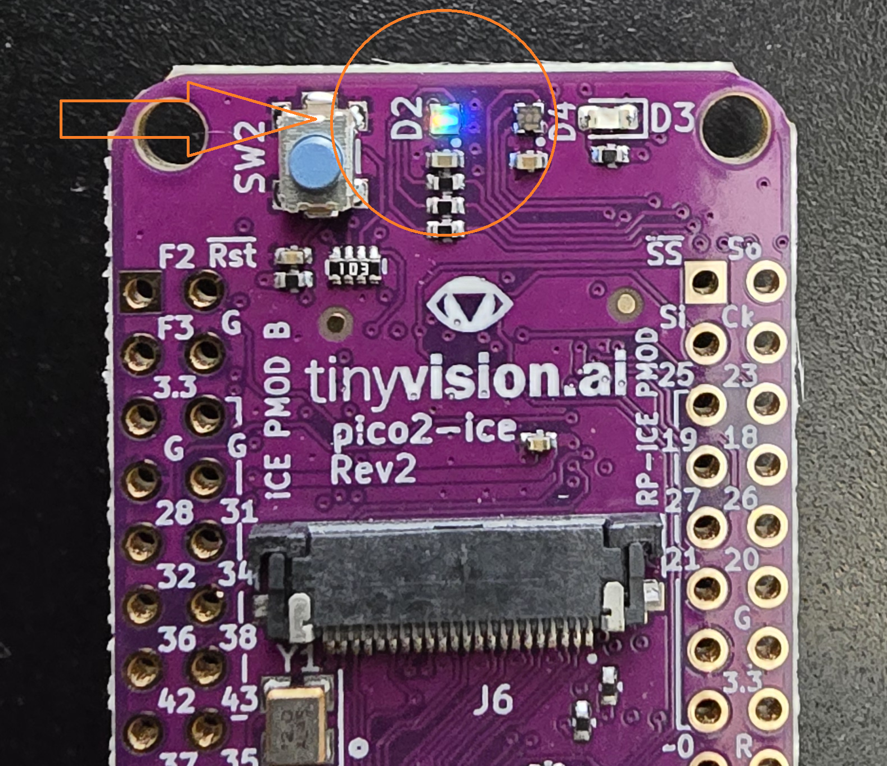

---
hide:
  - toc
---

# Hardware Setup
*Bitstream Evolution v2 — pico2-ice*

Before ordering any parts, please note that the current Bitstream Evolution toolchain supports Linux and macOS host machines. The hardware is handled through the iCEFARM system, which is designed to manage multiple pico2-ice boards in parallel, but can also handle single-board setups without issue.

## Bill of Materials

| Item | Approx. Cost | Where to Purchase |
| --- | --- | --- |
| pico2-ice Development Board | ~$50 | [pico2-ice.tinyvision.ai](https://pico2-ice.tinyvision.ai/) |
| USB-C Cable (for programming) | ~$10 | [Amazon - 6 inch Short Fast Charging Cord, 5 Pack Durable USB A to USB Type C](https://www.amazon.com/dp/B08LL1SVZD?ref_=ppx_hzsearch_conn_dt_b_fed_asin_title_3&th=1) |
| USB-C Hub (optional, for multiple boards) | ~$47.49 | [Amazon - SABRENT 10-Port 60W USB 3.0 Hub](https://www.amazon.com/dp/B0797NZFYP?ref_=ppx_hzsearch_conn_dt_b_fed_asin_title_1&th=1) |

_Total hardware cost: roughly \$50 for 1 device. For 20 a device array ~ \$1,150._

## Assembly Steps

# pico2-ice Setup

!!! warning "Use the Provided Cables"
    If you use a bad cable, the boards may not connect properly when following the instructions here: [Programming the MCU](https://pico2-ice.tinyvision.ai/md_programming__the__mcu.html)

## FAQ

### The board does not enter bootloader mode (BT to GND or SW1)

By default, if you do not hold down the **SW1** button or connect **BT to GND** when plugging in the USB cable, the board loads the default firmware which looks like this:

<figure markdown="span">
  { width="400" }
  <figcaption>Default firmware behavior — board is <strong>not</strong> in bootloader mode.</figcaption>
</figure>

To enter the bootloader mode, you need to either hold down the **SW1** button or connect **BT to GND** when plugging in the USB cable. The board will then enter bootloader mode which looks like this:

<figure markdown="span">
  { width="400" }
  <figcaption>Board successfully in bootloader mode.</figcaption>
</figure>

## iCEFARM: FPGA Array Resource Manager

We have a special job distributor for the pico2-ice boards. The software was developed by Jackson Heil and can be found here:

[:octicons-mark-github-16: heiljj/usbip-ice](https://github.com/heiljj/usbip-ice){ .md-button }
