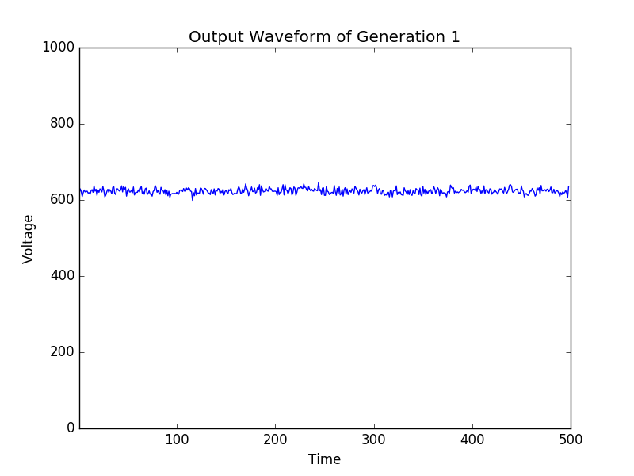
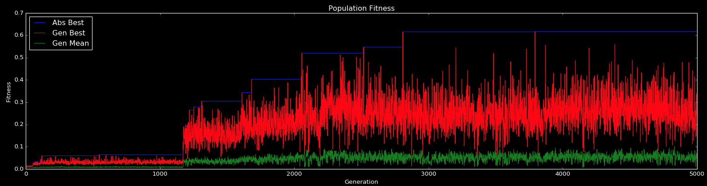
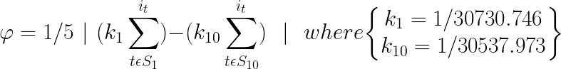

# Datasets and Experimental Results

## Completed Experiments

### Variance Maximization
**Status**: ✅ Completed | **Duration**: 4-5 hours | **Platform**: iCE40hx1k


*Real-time evolution of signal variance over generations*

**Experimental Parameters:**
- **Population Size**: 50 individuals
- **Generations**: 100
- **Mutation Rate**: 0.005
- **Crossover Rate**: 0.5
- **Runtime**: 4-5 hours

**Fitness Function:**
$$f_{variance} = \frac{1}{n} \sum_{i=1}^{n-1} |x_{i+1} - x_i|$$

Where $x_i$ represents sequential ADC samples from the microcontroller.

**Key Results:**
- Successfully evolved circuits with increasing signal amplitude
- Demonstrated feasibility of analog evolution on modern FPGAs
- Established baseline methodology for future experiments
- Clear progression in fitness over generations

**Dataset Includes:**
- Complete population bitstreams for all generations
- ADC measurement data for each individual
- Fitness evolution tracking
- Statistical analysis of population diversity

[📊 **Download Variance Dataset**](https://github.com/evolvablehardware/datasets/tree/main/variance-maximization)

---

### Pulse Oscillation  
**Status**: ✅ Completed | **Duration**: 6-8 hours | **Platform**: iCE40hx1k


**Experimental Overview:**
Recreation of Thompson's seminal pulse generation experiment using modern hardware. The goal is to evolve an analog circuit capable of generating pseudo-stable periodic oscillations without external clock signals.

**Technical Specifications:**
- **Target Period**: 1ms (biological timescale)
- **Evaluation Time**: 100ms per individual
- **Measurement Resolution**: 10-bit ADC at 10kHz
- **Success Criteria**: Stable oscillation detection

**Key Achievements:**
- Successfully replicated classic EHW results on iCE40 platform
- Generated stable oscillatory behavior without external clock
- Validated evolution of timing-sensitive analog circuits
- Demonstrated biological timescale operation


*Fitness evolution showing convergence to stable pulse generation*
*Best individual's pulse characteristics*

**Dataset Features:**
- Oscillation period measurements across generations
- Waveform data for best individuals
- Stability analysis over extended operation
- Circuit topology analysis of successful designs

[📊 **Download Pulse Dataset**](https://github.com/evolvablehardware/datasets/tree/main/pulse-oscillation)

---

### Tone Discrimination
**Status**: 🔬 Ongoing | **Expected Duration**: 10-15 hours | **Platform**: iCE40hx1k


*Current progress in tone discrimination evolution*


*Target discrimination function profile*

**Experimental Challenge:**
Recreating Thompson's most famous experiment: evolving a circuit to discriminate between two different frequency tones (1kHz and 10kHz). This represents one of the most sophisticated analog signal processing tasks demonstrated in evolvable hardware.

**Current Setup:**
- **Input Frequencies**: 1kHz (logic low) and 10kHz (logic high)
- **Expected Output**: Binary classification signal
- **Evaluation Method**: FFT-based frequency response analysis
- **Success Metric**: > 90% classification accuracy

**Progress Status:**
- ✅ Circuit evolution platform established
- ✅ Fitness evaluation system implemented  
- 🔄 Population optimization in progress
- ⏳ Advanced frequency analysis under development

**Preliminary Results:**
- Basic frequency sensitivity detected in early generations
- Population showing increased response to input changes
- Promising candidate circuits identified for detailed analysis

[📊 **Monitor Live Progress**](https://github.com/evolvablehardware/datasets/tree/main/tone-discrimination)

---

## Future Experiment Datasets

### Sine Wave Oscillator
**Status**: 📅 Planned | **Priority**: High

**Challenge**: Developing clean sine wave oscillators from analog components represents a significant engineering challenge that could benefit from evolutionary approaches.

**Expected Contributions:**
- Ultra-low distortion oscillator designs
- Novel analog synthesis techniques
- Power-efficient oscillator topologies

### Reservoir Computing
**Status**: 📅 Planned | **Priority**: Medium

**Concept**: Treating unclocked FPGA fabric as a reservoir and incorporating a physical, linear readout layer for computation.

**Research Questions:**
- Can FPGA analog behavior serve as computational reservoir?
- How does reservoir size affect computational capacity?
- What readout mechanisms work best?

### Speech Synthesis and Recognition
**Status**: 📅 Planned | **Priority**: Long-term

**Vision**: Evolving analog circuits to interpret and generate audio signals that occur at biological timescales.

**Applications:**
- Ultra-low power voice interfaces
- Embedded speech processing
- Biomimetic audio systems

---

## Research Datasets

### Circuit Evolution Repository
**Complete evolutionary histories and analysis**

Our comprehensive dataset repository includes:

- **Bitstream populations**: Complete evolutionary histories
- **Performance metrics**: Fitness landscapes and convergence analysis  
- **Hardware measurements**: Raw ADC data and signal characteristics
- **Topology analysis**: Circuit structure and connectivity patterns
- **Environmental data**: Temperature, power, and timing measurements

[🗃️ **Browse Complete Repository**](https://github.com/evolvablehardware/BitstreamEvolutionPopulations)

### Measurement Standards
**Reproducibility and benchmarking protocols**

To ensure experimental reproducibility, we maintain standardized measurement protocols:

**ADC Sampling Standards:**
- Sample rate: 10 kHz minimum
- Resolution: 10-bit minimum  
- Buffer size: 1000 samples per evaluation
- Averaging: 3 trials per individual
- Environmental logging: Temperature and supply voltage

**Fitness Evaluation Standards:**
- Measurement duration: 100ms per individual
- Settling time: 10ms before measurement
- Statistical validation: Multiple independent runs
- Data format: HDF5 with comprehensive metadata

### Benchmark Problems
**Standardized challenges for comparing approaches**

**Level 1: Basic Functions**
- Variance maximization
- Simple oscillation
- DC offset generation

**Level 2: Signal Processing**  
- Tone discrimination
- Filter implementation
- Amplifier design

**Level 3: Complex Behaviors**
- Multi-frequency oscillators
- Adaptive circuits
- Environmental compensation

---

## Data Access and Collaboration

### Open Data Initiative
**All experimental data freely available**

We maintain a commitment to open science and reproducible research:

- **Creative Commons licensing**: All datasets available under CC-BY-4.0
- **Standard formats**: HDF5, CSV, and MATLAB-compatible exports
- **Comprehensive metadata**: Experimental conditions and parameters
- **Version control**: Git-based tracking of dataset evolution
- **DOI registration**: Citable dataset versions

### Collaboration Opportunities
**Contributing to our growing dataset collection**

We welcome contributions from the community:

**Data Contributions:**
- Novel experimental results
- Replication studies
- Extended parameter sweeps
- Environmental variation studies

**Analysis Contributions:**
- Statistical analysis methods
- Visualization techniques
- Machine learning applications
- Theoretical modeling

### Usage Guidelines
**Responsible use of experimental data**

**Citation Requirements:**
- Cite original experimental papers
- Reference dataset DOIs
- Acknowledge the evolvable hardware community
- Share derivative work when possible

**Quality Assurance:**
- Verify experimental setup compatibility
- Validate measurement calibration
- Document any modifications or adaptations
- Report unexpected results or anomalies

[📧 **Contact for Collaboration**](mailto:data@evolvablehardware.org)

---

## Measurement Infrastructure

### Data Collection Pipeline
**Automated experimental data management**

```python
# Example data logging structure
experiment_data = {
    'experiment_id': 'variance_max_001',
    'timestamp': '2025-01-15T10:30:00Z',
    'platform': 'iCE40hx1k',
    'population_size': 50,
    'generation': 42,
    'individual_id': 'gen42_ind23',
    'bitstream': binary_data,
    'fitness_score': 0.847,
    'adc_samples': measurement_array,
    'environmental': {
        'temperature': 23.5,
        'supply_voltage': 3.29,
        'humidity': 45.2
    }
}
```

### Analysis Tools
**Processing and visualization frameworks**

- **Real-time plotting**: Live fitness tracking and signal display
- **Statistical analysis**: Population diversity and convergence metrics
- **Signal processing**: FFT analysis and filtering
- **Machine learning**: Pattern recognition in evolved circuits
- **Comparative analysis**: Cross-experiment performance comparison

---

*Our dataset collection represents the most comprehensive documentation of modern FPGA-intrinsic evolvable hardware experiments, enabling reproducible research and collaborative advancement of the field.*


