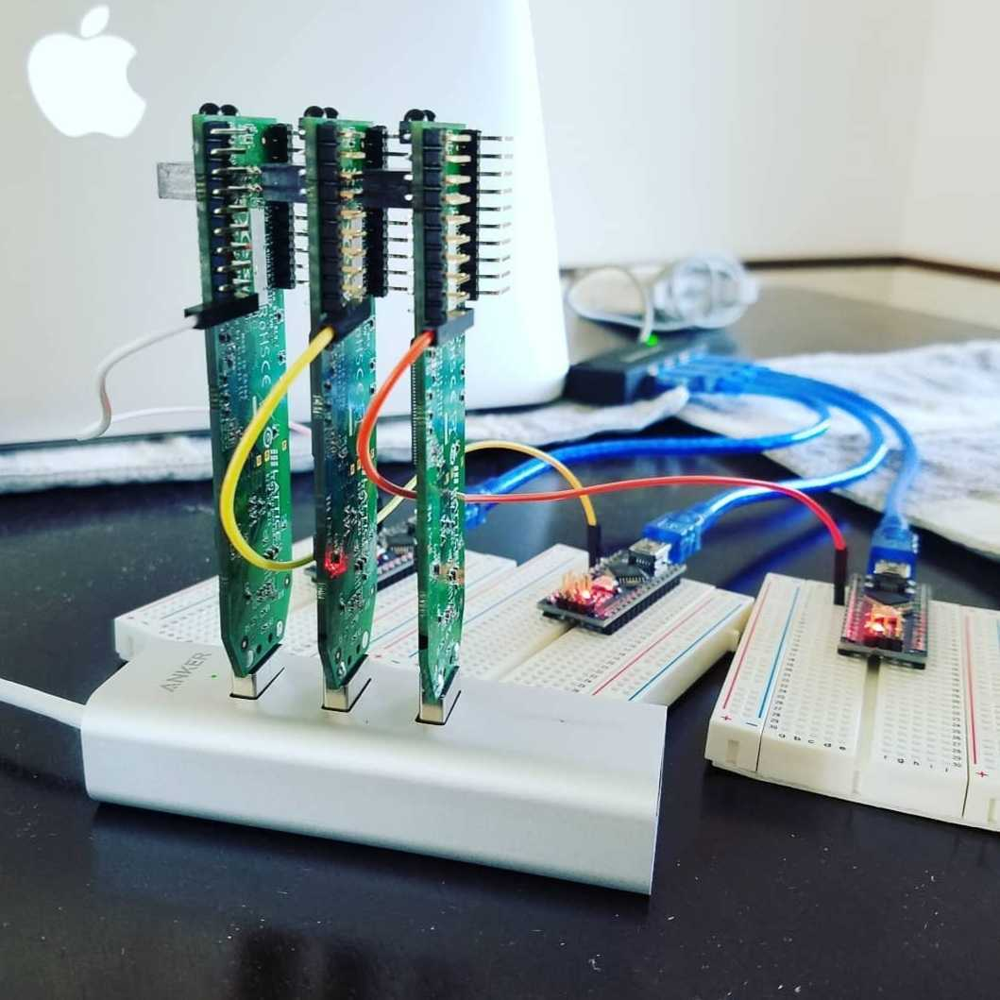

# Hardware Resources

!!! bug "TODO"
    Do we want this? This could describe the overall hardware required for each project, and link to them.

    I don't think that it is reasonable to require all EHW projects to use the same hardware, although there will be similarities. As such, I think that each project should maintain their own individual documentation about the hardware requirements that are needed to run them, allowing them to be the most up to date without constantly having to negotiate with other projects or constantly update the main site.

    To allow for this, I created the "Projects" tab to allow people to find the particular project of interest to them.

## Primary Platform: Lattice iCE40hx1k

*Complete evolvable hardware experimental setup*

